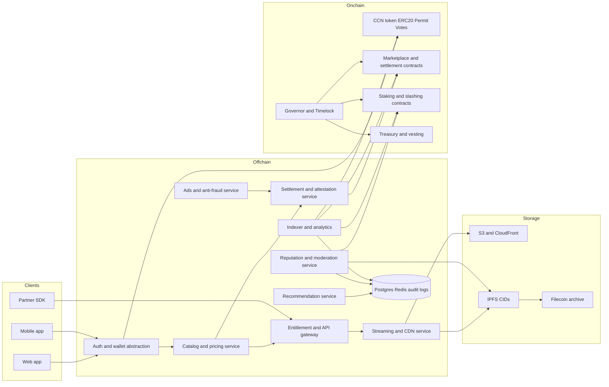
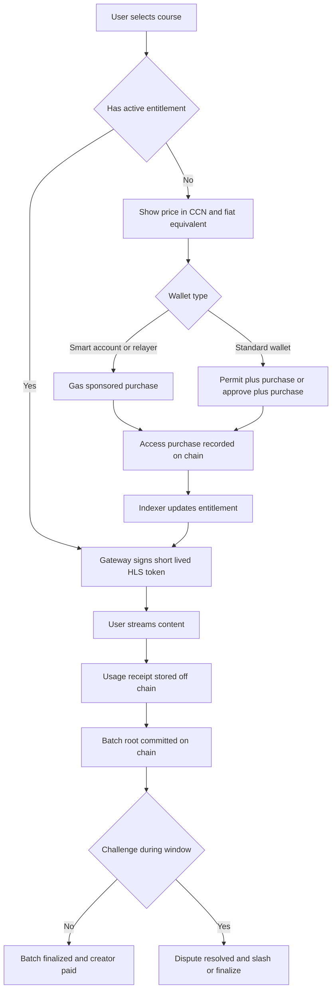
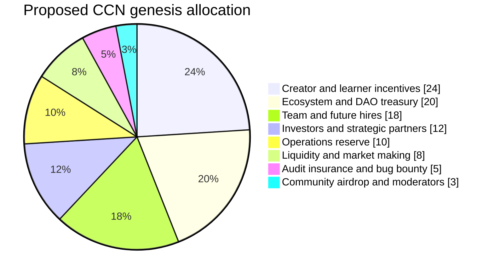
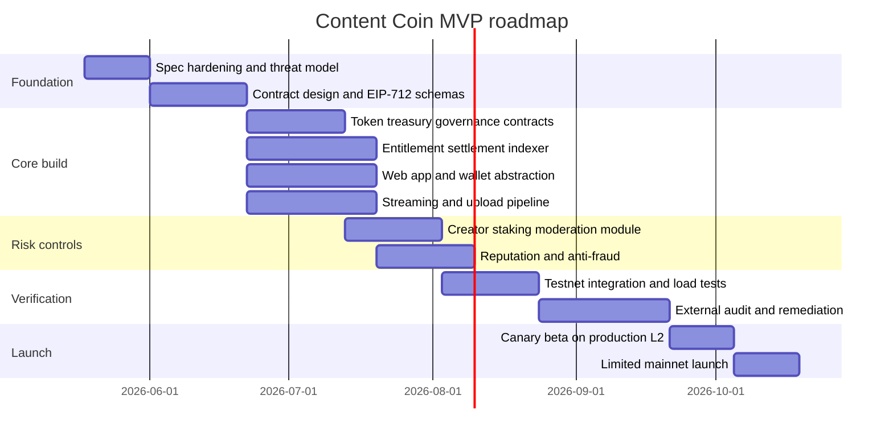

# Content Coin Whitepaper and Implementation Blueprint

## Executive summary

As of May 16, 2026, the public `seamoonpandey/content-coin` repository is best understood as a **product concept and requirements note**, not as an implemented software system. The public repository landing page shows a single `README.md` under “Folders and files,” only two commits, no published releases, and no packages. The README defines Content Coin as a decentralized educational platform with coin-based content access, creator payouts, voluntary ad-view rewards, personalized recommendations, React/Web3 frontend expectations, Node.js/NestJS backend expectations, Python ML components, and Ethereum/Polygon plus AWS S3/CloudFront in the operating environment, with IPFS/Filecoin listed as a future phase. citeturn2view0

That starting point is workable, but only if you **do not** try to put the whole product on-chain. The practical senior recommendation is a **hybrid architecture**: keep scarce economic state on-chain, keep high-frequency product state off-chain, and bridge the two with signed receipts, batch commitments, challenge windows, and an indexer. In practice, that means token balances, staking, slashing, vesting, governance, and settlement roots should live on an EVM chain, while video delivery, recommendations, ad verification, moderation workflows, analytics, and most reputation evidence should remain off-chain. This follows the repository’s own emphasis on low-latency streaming, microservices, and 1M+ user scale, while aligning with current rollup economics and Ethereum’s data-availability roadmap. citeturn2view0turn29search18turn6search5turn23search0turn23search1

My concrete recommendation for a first production implementation is:

| Decision area | Recommended choice | Why this is the default |
|---|---|---|
| Settlement chain | **Arbitrum One** | Best default balance of Ethereum security, EVM compatibility, lower fees, and clear migration path to an app chain |
| Token standard | **ERC-20 + ERC-2612 Permit + ERC20Votes** | Interoperable, supports gas-efficient approvals and governance snapshots |
| Governance | **OpenZeppelin Governor + TimelockController** | Modular, battle-tested governance pattern with execution delays |
| Wallet UX | **ERC-4337 smart accounts preferred; EIP-2771 relayer fallback** | Removes native-gas friction for first-time learners |
| Storage | **S3/CloudFront for hot video + IPFS CID anchoring + Filecoin archival later** | Product-grade latency now, content integrity and portability later |
| Reputation | **Non-transferable reputation score anchored by Merkle roots** | Prevents buying influence with tokens alone |
| Oracle model | **No always-on oracle in v1; optimistic assertions for disputes; Chainlink only for FX/pricing if needed** | Keeps complexity and attack surface down |
| Cash-out | **KYC-gated creator cash-out via licensed partner** | Avoids turning v1 into an uncontained compliance problem |

These choices are directly supported by the EVM standard stack, OpenZeppelin’s governance/token tooling, Ethereum’s account-abstraction and meta-transaction standards, Arbitrum’s L2 model, and the repository’s own architectural direction. citeturn3search0turn3search1turn3search2turn22search4turn22search2turn32search2turn4search20turn4search6turn29search18turn2view0

Economically, Content Coin should launch with a **hard-capped genesis supply**, treasury-controlled emissions from reserved pools rather than unrestricted minting, fee burns on paid access, creator and operator staking, and a separate non-transferable reputation layer. That structure is more consistent with the repository’s preference for fixed, auditable supply, and it also reflects the platform-token literature: tokens can improve platform-user alignment, but dilution and governance concentration become major failure modes if supply policy is open-ended or voting power is too concentrated. citeturn2view0turn14search1turn14search3turn28search1turn28academia12turn28academia13

If you execute the plan below, you can begin building immediately: define the contracts and typed-data receipts first, stand up the entitlement and settlement services second, integrate wallet abstraction and streaming third, then add creator staking, challengeable moderation, and the first reputation system before audit and testnet launch. The path to an audited MVP is realistically **four to six months** with a focused team, and the path to scale is to keep product operations off-chain while progressively decentralizing economic settlement, storage integrity, and governance. citeturn2view0turn30search1turn31search2turn31search3

## Repository baseline and problem statement

The README’s core idea is strong: a tokenized educational platform for improved access, especially for underprivileged students, where users can buy coins, earn coins by voluntarily watching ads, or earn by contributing content, while creators receive either fixed-pay or pay-per-view compensation. It also already anticipates personalized recommendations, subscription plans, wallet-to-wallet transfers, real-money exchange, admin oversight, and future decentralized storage. The operating environment proposed in the README is modern and plausible: React/Web3 on the frontend, Node.js/NestJS microservices, PostgreSQL/MongoDB, Python ML, Ethereum/Polygon with Solidity, and AWS S3 + CloudFront for streaming. citeturn2view0

The repository’s main weakness is not conceptual; it is **implementation incompleteness**. The public repository state exposes no visible smart contracts, service code, frontend code, tests, infrastructure manifests, CI workflows, or deployment artifacts. From a delivery standpoint, that means the present “codebase” is really a **requirements draft**, and any production whitepaper must fill in the missing implementation-specific decisions around settlement, fraud resistance, upgradeability, moderation, storage integrity, governance, key management, and regulatory boundaries. citeturn2view0

A practical way to frame the current state is this:

| What the repository already specifies | What still must be specified before real implementation |
|---|---|
| Educational marketplace concept | Concrete chain choice and migration strategy |
| Coin-based access and rewards | Token contract modules, vesting, governance, and treasury mechanics |
| Ad-based reward model | Anti-bot, anti-Sybil, and advertiser settlement logic |
| Creator payouts | Bonding, slashing, plagiarism disputes, and fraud proofs |
| Recommendation engine | Retrieval/ranking architecture, feature pipelines, and abuse controls |
| Wallet integration | Permit, relayers, account abstraction, recoverability, and gas sponsorship |
| AWS streaming and future IPFS | Clear hot/cold/archive storage policy and CID anchoring |
| 1M+ users and low latency | A strict on-chain/off-chain split and batch-settlement strategy |

The problem statement is therefore broader than “build a token.” Content Coin has to solve four hard problems at once. First, it must reduce the barrier to accessing quality learning material while preserving a viable creator economy. Second, it must reward activity without making spam and botting profitable. Third, it must use decentralization where it actually adds trust, rather than degrading user experience by forcing every interaction on-chain. Fourth, it must handle the fact that educational content, ad rewards, identity, and cash-out all trigger reputational, compliance, and abuse risks. The README itself already hints at all four by requiring low-latency streaming, audited smart contracts, encrypted user data, ad-fraud prevention, voluntary ads, and 1M+ user scale. citeturn2view0

The broader literature reinforces that framing. Catalini and Gans argue that blockchain’s main platform-economic contribution is lowering the **cost of verification** and the **cost of networking**; that is useful for settlement, entitlement proof, and transparent treasury operations, but it does not mean all operational state belongs on-chain. At the same time, Douceur’s classic Sybil result shows that open distributed systems are structurally vulnerable to fake-identity attacks without stronger identity or economic assumptions, and empirical DAO-governance studies show that token voting often becomes concentrated among a small set of actors. In other words, a naive “tokenize everything” design would likely recreate platform problems in a more brittle form. citeturn13search0turn25search2turn28academia12turn28academia13

The design target, then, should be a system that uses blockchain for **economic finality, auditable budgets, rights delegation, and accountable penalties**, while leaving **streaming, ranking, moderation evidence collection, and user-facing latency** off-chain. That is the core architectural conclusion of this whitepaper. citeturn2view0turn29search18turn6search5turn23search1

## Literature review

The protocol foundation is straightforward. Bitcoin established the basic idea of peer-to-peer digital value without a trusted intermediary. Ethereum extended that model into a general smart-contract platform, and Ethereum’s modern standards now provide the building blocks Content Coin needs: ERC-20 for interoperable fungible assets, ERC-2612 for signed approvals, EIP-712 for structured off-chain signing, ERC-4337 for account abstraction, and EIP-2771 for relayed meta-transactions. On the scaling side, Arbitrum Nitro and the OP Stack represent the mature optimistic-rollup path, while EIP-4844 and proto-danksharding reduce data-availability costs for rollups by introducing blob transactions. The practical takeaway is that Content Coin should be built as an EVM application that assumes a rollup-first deployment, not an L1-first deployment. citeturn16search0turn15search2turn3search0turn3search1turn3search2turn22search4turn22search2turn15search1turn6search5turn23search0turn23search1

For infrastructure, the storage and oracle literature suggests a modular approach. Benet’s IPFS paper and the current IPFS docs make content addressing and immutable identifiers central; CIDs let the system prove integrity of course artifacts regardless of where they are hosted. Filecoin extends that model with cryptographically verifiable storage and retrieval markets. Chainlink’s whitepapers and docs show the strongest general-purpose oracle/computation network for external data and custom computation, while UMA’s Optimistic Oracle is better suited to **disputable assertions** about off-chain facts. Pyth is excellent for first-party price feeds but is less central to Content Coin unless you need market-price synchronization. The implication is that Content Coin should use IPFS for verifiable content identity, Filecoin later for durable archival, and **optimistic assertions** for disputed business facts like plagiarism, fraud, or ad-completion disputes. citeturn7search0turn27search2turn27search18turn7search3turn7search6turn15search0turn15search8turn9search0turn9search1turn9search2turn9search5turn8search1

The trust-and-reputation literature is even more important for this project than the chain literature. Resnick and collaborators showed how feedback mechanisms can sustain trust in marketplaces with significant fraud risk; Dellarocas framed online feedback as the digitization of word-of-mouth; EigenTrust introduced graph-based propagation of trust; Jøsang and Ismail’s Beta reputation system provided a simple probabilistic update rule for binary evidence; Miller, Resnick, and Zeckhauser showed how peer-prediction can make honest reporting incentive-compatible; Jurca and Faltings extended that into collusion-resistant feedback-payment design; and Gneiting and Raftery formalized proper scoring rules for truthful probabilistic reporting. Together, these results imply that Content Coin should **not** rely on like-counts or star averages alone. It should use evidence-weighted reputation, delayed and challengeable rewards, and review bonuses tied to later agreement rather than immediate positivity. citeturn10search4turn10search1turn10search2turn12search2turn11search20turn11search2turn11search3

The literature also warns about attacks. Douceur’s Sybil result remains the central warning: purely open identity systems are vulnerable. Token-curated-registry work shows that challengeable staking-and-voting systems can curate lists or roles, but equilibrium quality depends heavily on participation, incentives, and collusion resistance. Governance studies of live DeFi systems show persistent concentration of voting power and meaningful cost barriers for small holders. For Content Coin, that means verified creators, moderators, and payout operators should be placed behind **bonded role registries**, while governance should combine token voting with delegation, time delays, proposal bonds, and reputation gates rather than assuming “one token, one vote” is enough. citeturn25search2turn26search1turn26search12turn28academia12turn28academia13

Finally, the recommendation and platform-economics literature informs the product layer. Covington, Adams, and Sargin’s two-stage YouTube system, together with Wide & Deep recommender work, supports a practical architecture where candidate retrieval and ranking are separate services, continuously retrained, and kept off-chain. On the economics side, Catalini and Gans, Cong-Li-Wang, and Abadi-Brunnermeier all point in the same direction: tokens can align platform and user incentives, but only if supply policy is credible and governance does not degenerate into durable rent extraction or dilution. That is precisely why this blueprint recommends a hard cap, vesting-based circulation, treasury budgeting, fee burns, and a separate non-transferable reputation signal. citeturn17search0turn17academia15turn13search0turn14search1turn28search1

## Recommended architecture and system design

The central architecture decision is simple: **do not model every view, click, ad completion, or recommendation on-chain**. The repository requires low-latency streaming and 1M+ user scale; rollups make token settlement cheaper, but even with EIP-4844, high-frequency consumer product telemetry remains a bad fit for direct on-chain writes. Therefore, Content Coin should operate like a **consumer application with crypto settlement rails**, not like a fully on-chain app. citeturn2view0turn23search0turn23search1

The chain options that matter most are the following:

| Option | Consensus and security model | Advantages | Trade-offs | Best use | Migration path |
|---|---|---|---|---|---|
| **Arbitrum One** | Optimistic rollup inheriting Ethereum-level security | Mature EVM toolchain, lower fees than L1, strong DeFi/liquidity integration | Multi-day L1 withdrawal finality, rollup operational assumptions | **Recommended v1 default** | Later migrate heavy traffic to an Arbitrum chain |
| **OP Stack chain / OP Mainnet first** | Modular optimistic rollup stack with fault-proof system and Ethereum settlement | Strong path to your own interoperable chain, standardized deployment and upgrades | More operator complexity if you launch your own chain early | Best if you already know you want an app chain | Start on OP Mainnet or deploy an OP Chain later with `op-deployer` |
| **Polygon PoS** | Two-layer PoS sidechain with Heimdall/Bor and Ethereum checkpointing | Very low fees, broad wallet support, easy MVP economics | Different trust/security profile than Ethereum rollups | Budget-constrained MVP or high-volume micro-rewards | Migrate token and treasury to rollup later if trust requirements increase |

This comparison synthesizes the official Ethereum PoS/finality material, Arbitrum docs/Nitro whitepaper, OP Stack documentation, and Polygon PoS architecture docs. citeturn5search0turn5search12turn29search18turn15search1turn29search5turn6search5turn6search3turn31search4turn31search3turn5search3turn5search11turn5search19

For storage, the right answer is not either/or but staged composition:

| Storage layer | Latency | Integrity guarantees | Persistence model | Role in Content Coin |
|---|---|---|---|---|
| **S3 + CloudFront** | Best | Operational, not cryptographic | Centralized cloud durability | Hot video delivery and HLS/DASH manifests |
| **IPFS pinned content** | Medium | CID-based content integrity | Depends on pinning/provider availability | Canonical content artifacts, metadata snapshots, certificates |
| **IPFS + Filecoin archival** | Lower than CDN, durable for archive | CID + cryptographic storage proofs | Decentralized archival markets | Long-term course archives, legal evidence, versioned packs |

The README already points to AWS S3 + CloudFront with future IPFS/Filecoin support, while IPFS and Filecoin primary sources show exactly why the combination is sensible: IPFS gives content-addressed identifiers and integrity, while Filecoin adds cryptographically verified persistence. citeturn2view0turn27search2turn27search18turn27search6turn7search0turn7search3turn7search6

Oracle selection should be equally conservative:

| Oracle model | Best for | Strength | Weakness | Recommendation |
|---|---|---|---|---|
| **Operator attestations + challenge window** | Access receipts, ad completions, internal payout batches | Minimal surface area, easiest to ship | Requires bonded operators and dispute process | **Recommended baseline** |
| **Chainlink Functions / Data Feeds** | FX rates, external reference pricing, partner API calls | Strong ecosystem, broad support, decentralized data feeds and custom compute | More moving parts and cost than needed for core v1 | Add only where external truth is required |
| **UMA Optimistic Oracle** | Plagiarism disputes, moderation escalations, content-fraud assertions | Purpose-built for arbitrary disputable truths | Longer resolution path, dispute UX needed | Best for high-value disputes in v2 |
| **Pyth** | Market prices for treasury or swaps | Strong first-party price-feed model | Mostly price-centric, less useful for content assertions | Optional, treasury-only |

This reflects official Chainlink, UMA, and Pyth documentation. citeturn9search0turn9search1turn9search2turn9search5turn8search1turn8search4

The on-chain and off-chain responsibilities should be split explicitly:

| Domain | On-chain responsibility | Off-chain responsibility |
|---|---|---|
| Token and treasury | Balances, vesting, governance votes, budget disbursements | Fiat dashboards, accounting exports |
| Access economics | Price commitments, batch settlement roots, dispute outcomes | Entitlement cache, HLS token issuance, purchase orchestration |
| Creator quality | Bonds, slashes, registry status | Review collection, plagiarism scans, moderation evidence |
| Ads and learner rewards | Reward pool accounting, final reward settlement | View verification, liveness checks, anti-bot scoring |
| Recommendations | None, except optional public model-hash anchoring | Retrieval, ranking, experimentation, abuse controls |
| Storage integrity | Optional CID commitments and archival notarization | Video hosting, transcoding, gateway operations |

That split is the only credible way to satisfy the README’s performance and usability requirements while preserving blockchain-native auditability where it matters. citeturn2view0turn23search1



The main user flow should look like this:



The contract suite should be small and modular. I would build `ContentCoinToken.sol` as `ERC20`, `ERC20Permit`, and `ERC20Votes`; `Treasury.sol` with budget roles and `VestingWallet`-based distributions; `Marketplace.sol` for price schedules, purchase settlement, batch commitments, and dispute hooks; `StakingRegistry.sol` for creator/operator bonds and slash logic; `RoleRegistry.sol` for verified creators and moderators; and `ContentGovernor.sol` plus `TimelockController`. OpenZeppelin’s documentation explicitly supports these patterns and notes that `ERC20Votes` is the expected base for token-driven governance with historical vote snapshots. citeturn32search2turn32search6turn32search5turn4search20turn4search6turn32search8

For code organization, start with a monorepo and keep contracts, services, SDK, and infra versioned together:

```text
content-coin/
  apps/
    web/
    admin/
    api-gateway/
  contracts/
    token/
    treasury/
    settlement/
    staking/
    governance/
  services/
    catalog/
    entitlement/
    streaming/
    ads/
    reputation/
    settlement/
    indexer/
  packages/
    sdk-ts/
    shared-types/
    eip712/
  infra/
    terraform/
    k8s/
    observability/
```

At the API layer, expose a small public surface first: `POST /purchase-intents`, `GET /content/:id/entitlement`, `POST /attestations/ad-view`, `POST /settlement-batches`, `GET /creator/:id/reputation`, `GET /treasury/budgets`, and a websocket or SSE event stream for entitlement changes. Pair that with typed EIP-712 messages such as `PurchaseIntent`, `AccessReceipt`, `AdViewReceipt`, and `SlashClaim`. That gives you an implementation path that is immediately compatible with `permit`, typed signing, and later smart-account flows. citeturn3search1turn3search2turn22search4

## Tokenomics, incentives and reputation

The token design should follow a **dual-layer model**:

- `CCN`: a transferable ERC-20 utility and governance token.
- `REP`: a **non-transferable** reputation score derived from off-chain evidence and anchored on-chain through periodic Merkle roots and challengeable updates.

This separation is important. Tokens are scarce economic units; reputation is an earned trust signal. Mixing them collapses quality into purchasing power, which the marketplace and DAO-governance literature strongly warns against. citeturn14search1turn28search1turn28academia12turn28academia13

The recommended launch tokenomics are:



| Bucket | Share | Suggested release rule |
|---|---:|---|
| Creator and learner incentives | 24% | Held in treasury; budgeted over 48 months |
| Ecosystem and DAO treasury | 20% | Timelocked, proposal-driven disbursement |
| Team and future hires | 18% | 12-month cliff, then 36-month linear vest |
| Investors and strategic partners | 12% | 12-month cliff, then 24–36 month linear vest |
| Operations reserve | 10% | Held for compliance ops, liquidity buffers, and chain migration |
| Liquidity and market making | 8% | Controlled release, not fully liquid at TGE |
| Audit, insurance, and bug bounty | 5% | Treasury-controlled reserve; no general circulation |
| Community airdrop and moderators | 3% | Staged across beta and first production year |

The token should launch with a **hard cap of 1,000,000,000 CCN**, minted once at genesis into treasury and vesting contracts. This fits the README’s preference for fixed, auditable supply while also solving the credible-commitment problem emphasized in token-platform research: unrestricted future dilution weakens alignment and depresses token utility. Use `VestingWallet` or functionally similar vesting contracts for all non-circulating buckets. citeturn2view0turn14search1turn14search3turn28search1turn32search5

**Inflation and deflation policy.** In years one through four, there should be **no discretionary mint inflation**; effective circulating supply growth comes only from vesting and treasury release. Deflationary pressure comes from fee burns and slashing. I recommend the following v1 rules:
- burn 5% of every paid content-access fee;
- route 15% of paid-access fees to treasury;
- direct 20% of slashed stake to burn, 40% to the successful challenger, and 40% to treasury/insurance reserve;
- disallow new minting unless a supermajority governance vote activates a post-year-four emergency tail emission capped at 2% annualized.  
This preserves hard-cap credibility while still giving the protocol a last-resort security budget. The choice is also consistent with platform-finance work showing that token supply policy is a core governance instrument, not a cosmetic header. citeturn14search1turn28search1turn24search2turn24search0

The **on-chain settlement model** should be batch-based:

\[
M_t = \operatorname{MerkleRoot}\left(h(r_1), h(r_2), \ldots, h(r_n)\right)
\]

where each receipt \(r_j\) is a typed, signed off-chain event such as a purchase, entitlement issuance, ad-completion attestation, or creator-payout input. The chain stores the batch root, batch totals, operator bond, and challenge window. If no valid challenge is presented before \(\Delta\), the batch finalizes automatically. This model borrows the dispute-window logic of optimistic systems without forcing Content Coin itself to become a full rollup. citeturn3search2turn29search18turn29search5turn6search3

The **creator payout function** should reward both direct demand and durable quality:

\[
P_{c,t} = \sum_{a \in A_{c,t}} p_a (1 - b - \tau) + \eta q_{c,t}\ln(1 + u_{c,t}) - \phi f_{c,t}
\]

where \(A_{c,t}\) is the set of valid paid accesses, \(p_a\) is paid price, \(b\) is burn fraction, \(\tau\) is treasury take, \(q_{c,t}\) is creator quality/reputation, \(u_{c,t}\) is the number of validated completions or satisfied engagements, and \(f_{c,t}\) is validated fraud/plagiarism count. The logarithmic quality bonus matters: it prevents large creators from linearly overpowering everyone else while still rewarding sustained educational value. This is a practical translation of the platform-finance and reputation literature into payout policy. citeturn14search1turn10search4turn10search1

The **learner ad-reward function** must be capped and conditioned on anti-fraud signals:

\[
R^{ad}_{u,t} = \min\left(R^{day}_{max}, \sum_k \rho_k \mathbf{1}[v_k \land l_k \land \neg s_k]\right)
\]

where \(v_k\) is view completion, \(l_k\) is a humanity/liveness pass, \(s_k\) is a spam or bot flag, and \(\rho_k\) is the reward rate for the ad tier. This directly operationalizes the README’s voluntary-ad model while preventing the reward pool from becoming an extraction target. A hard daily cap is mandatory. citeturn2view0turn25search2

For **reputation**, use a Beta-posterior base layer:

\[
q_i(t)=\frac{\alpha_i(t)}{\alpha_i(t)+\beta_i(t)}
\]

with exponentially decayed evidence:

\[
\alpha_i(t)=\alpha_0+\sum_j \lambda^{\,t-t_j} w_j x_j,\qquad
\beta_i(t)=\beta_0+\sum_j \lambda^{\,t-t_j} w_j (1-x_j)
\]

where \(x_j \in \{0,1\}\) is validated positive/negative evidence and \(w_j\) weights source quality, stake, and confidence. This is the simplest production-ready version of a statistically grounded reputation system. If you later need fraud-ring resistance, add an EigenTrust-style propagation layer:

\[
\mathbf{r}=(1-a)C^{\top}\mathbf{r}+a\mathbf{p}
\]

where \(C\) is the normalized local-trust matrix and \(\mathbf{p}\) is a pre-trusted vector of verified baselines. citeturn12search2turn10search2

For **truthful reviews**, the best advanced design is to pay a delayed bonus using peer-prediction / proper-scoring ideas rather than immediate engagement farming:

\[
\text{bonus}_u = \mu\, s(\hat p_u, y), \qquad
s(p,y)=y\log p + (1-y)\log(1-p)
\]

where \(\hat p_u\) is the rater’s declared quality probability and \(y\) is later consensus or verified outcome. This makes “say whatever gets likes” less attractive than “report what you actually believe.” I would not ship this on day one, but I would design the schema so it can be added. citeturn11search20turn11search3

Staking and slashing should be role-sensitive. Let the required bond scale inversely with reputation:

\[
B_i = B_{min}\left(1+\kappa(1-q_i)\right)
\]

and let slashing depend on misbehavior class:

\[
S_i = \min\left\{B_i,\ s_f\mathbf{1}_{fraud}+s_p\mathbf{1}_{plagiarism}+s_b\mathbf{1}_{botting}+s_o\mathbf{1}_{operator\ misconduct}\right\}
\]

This means new or low-reputation creators post larger bonds than established ones, and settlement operators can be economically punished for invalid roots or withheld batches. The logic is borrowed from the general proof-of-stake idea that valuable stake should be destructible when actors misbehave. citeturn24search2turn24search0turn24search7

Governance should be **token-based but not token-only**. Use `ERC20Votes` for delegated voting snapshots, `Governor` for proposal lifecycle, and `TimelockController` for execution delays. However, require proposers to satisfy both a token threshold and a reputation threshold, and require any economic-parameter proposal to post a refundable proposal bond. This mitigates the live-governance concentration documented in major DeFi protocols and makes governance less cheap to spam. citeturn32search2turn4search20turn4search6turn28academia12turn28academia13

For launch, these parameter defaults are sensible:

| Parameter | Recommended v1 default |
|---|---:|
| Hard-capped supply | 1,000,000,000 CCN |
| Paid-access burn | 5% |
| Treasury take on paid access | 15% |
| Creator bond, verified | 500 CCN |
| Creator bond, unverified | 2,000 CCN |
| Settlement batch frequency | every hour or every 1,000 receipts |
| Batch challenge window | 24 hours |
| Governance proposal threshold | 0.5% of delegated circulating votes + minimum REP |
| Governance quorum | 4% of circulating delegated votes |
| Timelock for parameter changes | 72 hours |
| Timelock for treasury, upgrades, mint controls | 7 days |

These are starting parameters, not sacred constants. They are intentionally conservative and should be treated as the first audited governance configuration, not the final one.

## Security, privacy and compliance

The threat model for Content Coin is not just “smart-contract exploits.” It spans on-chain finance, off-chain abuse, consumer APIs, content moderation, and identity systems:

| Threat | Why it matters here | Primary mitigation |
|---|---|---|
| Reentrancy / auth bugs / bad upgrade path | Token, treasury, and slashing contracts hold value | OpenZeppelin primitives, minimal upgradeability, multi-stage audit |
| Fake ad views / Sybil learners | Reward pool can be drained by bots | Liveness checks, daily caps, delayed settlement, bonded operators |
| Plagiarized or fraudulent content | Creator incentives can reward abuse | Creator bonds, moderation evidence, dispute path, role registry |
| Invalid payout batch roots | Operators could steal treasury or creator allocations | Challenge window, operator bonds, reproducible receipts |
| Governance capture | Large token holders can change rules or drain treasury | Delegation, timelocks, proposal bonds, REP gates |
| Bridge / chain migration risk | Cross-chain tokens often fail at weakest link | Prefer canonical bridges, migrate rarely, isolate bridge authority |
| API abuse and resource exhaustion | Streaming and ad endpoints are expensive attack surfaces | OWASP-style rate limiting, authz, quotas, signed URLs |
| Wallet compromise / recovery failure | Consumer users lose funds or entitlements | Smart accounts, social recovery, short-lived session scopes |
| Data leakage | Educational, behavioral, and identity data are sensitive | PII minimization, encryption, retention limits, KYC segregation |
| Recommendation poisoning | Fraud rings can manipulate discovery | Robust features, quality filters, anomaly detection, reputation weighting |

The secure-contract baseline should be OpenZeppelin-centric: `AccessControl`, `Pausable`, `ERC20Permit`, `ERC20Votes`, `Governor`, `TimelockController`, and `VestingWallet`, with upgradeability used sparingly. OpenZeppelin explicitly warns that upgradeable proxies are difficult to use correctly; my recommendation is to keep the token, staking, and treasury logic as close to immutable as possible after audit, while leaving only non-core adapters upgradeable. Governance-sensitive changes should always pass through a timelock so users can exit before execution. citeturn32search8turn4search7turn4search11turn4search19turn18search22turn18search26

The dispute model should be **optimistic, evidence-based, and bonded**. Settlement operators, creator registrars, and moderator committees post assertions that are assumed valid unless challenged. For low-value disputes, an internal `DisputeResolver` contract plus authorized challenge committee is enough in v1. For high-value plagiarism or campaign-fraud disputes, integrate UMA’s Optimistic Oracle later so externally reviewable assertions can be escalated on-chain. This avoids overweighting always-on oracle infrastructure while still giving the system a path to decentralized adjudication. citeturn9search2turn9search5turn9search8turn9search19

The API and application layer must be designed against known web risks, not just crypto-native ones. OWASP’s API Security Top 10 remains highly relevant here because Content Coin will expose expensive endpoints for entitlements, ads, creator uploads, and analytics. Broken object-level authorization, broken authentication, and unrestricted resource consumption are all especially relevant to content and ad systems. Rate limits, per-user quotas, request signing for internal service-to-service communication, signed CDN tokens, and explicit object authorization checks need to be treated as core security requirements, not later hardening. citeturn18search5turn18search1turn18search9

Privacy must be handled by design. Do **not** place personal data, raw watch histories, ad clickstreams, plagiarism evidence, or KYC documents on-chain. IPFS CIDs can remain safe if what they reference is public or encrypted content, but any linkable learner profile, identity mapping, or behavioral evidence should remain off-chain and be deleted or redacted according to retention rules. GDPR is the right baseline reference here because it governs personal-data processing broadly, and its practical implication for blockchain systems is obvious: keep irreversible public ledgers free of personal information. citeturn19search0

If the platform has children or child-directed educational content, COPPA becomes relevant in the United States. The FTC’s rule makes clear that operators of services directed to children under 13, or operators with actual knowledge that they collect children’s personal data, face special consent and processing obligations. That means Content Coin should, at minimum, support age-band segmentation, parental-consent workflows where required, and a no-targeted-ads mode for child-directed experiences. If you cannot support that in v1, avoid marketing to that category initially. citeturn19search1turn19search4

The repository’s current mention of “coin to real money exchange” is the biggest compliance trigger. Once you allow token purchase, transfer, and especially creator cash-out, crypto-asset and AML regimes enter the picture. MiCA creates a formal EU regime for crypto-asset issuance and service provision, while FATF guidance continues to define the AML/CFT baseline around virtual assets and VASPs. The practical implication is clear: **do not build your own regulated exchange in v1**. Instead, gate creator cash-out behind KYC and sanctions screening, and integrate a licensed partner or regulated venue for off-ramping. If v1 can operate as purchase-on / spend-in / creator-cash-out-only-through-approved-rail, the architecture stays much safer. citeturn20search0turn21search0turn21search3

This section is legal-architecture guidance, not legal advice. But the engineering consequence is concrete: preserve optionality by keeping token controls, cash-out rules, and geographic policy switches configurable through governed policy modules rather than hardcoding global availability.

## Implementation roadmap, testing, deployment, UX, integrations, cost and scalability

A realistic MVP plan starts on **Monday, May 18, 2026** and treats this repository as a greenfield implementation program rather than an incremental code refactor. The right sequencing is contracts and receipt schemas first, entitlement and settlement services second, streaming and wallet UX third, then reputation, moderation, and audit. That ordering matches both technical dependency and risk reduction. citeturn2view0turn32search9



The staffing profile for that plan is approximately:
- 1 smart-contract engineer
- 2 backend/platform engineers
- 1 frontend engineer
- 1 DevOps/data engineer
- 0.5 product designer
- 0.5 ML/recommendation engineer starting in the second month
- external audit firm in the verification phase

That is roughly **20–28 engineering weeks** per month of calendar time, which puts the MVP in the **four- to six-month** band depending on team quality and how much wallet abstraction and moderation automation you insist on before launch.

The implementation milestones should be:

| Milestone | Dates | Deliverables | Exit criteria |
|---|---|---|---|
| Foundation | 2026-05-18 to 2026-06-05 | Final whitepaper, threat model, schema definitions, contract interfaces | All typed messages and economic state diagrams frozen |
| Core contracts | 2026-06-08 to 2026-06-26 | CCN token, treasury, governor, timelock, staking, settlement | Unit tests passing, storage layout frozen |
| Product core | 2026-06-29 to 2026-07-24 | Web app, upload flow, entitlement API, indexer, streaming | User can buy, unlock, and stream a course end-to-end |
| Abuse controls | 2026-07-27 to 2026-08-14 | Ad attestation, reputation roots, creator bonds, moderation dashboard | Fraud simulation harness working |
| Verification | 2026-08-17 to 2026-09-18 | Testnet deployment, fuzzing, load tests, external audit | No critical findings open |
| Launch | 2026-09-21 to 2026-10-16 | Canary release, creator onboarding, budget caps, observability | Bounded live launch with rollback path |

The testing plan needs four layers. **Contract testing** should include unit tests, differential tests against reference math, invariant tests for treasury conservation, and fuzzing of batch commitments, slashes, and governance roles. **Backend testing** should include authz, rate limiting, signed-URL issuance, and replay protection on all receipt flows. **Load testing** should focus on entitlement latency, HLS token issuance, upload workflows, and ad-event volume rather than only blockchain TPS. **Red-team testing** should explicitly simulate fake creators, fake learners, batch-forgery attempts, stuck sequencer conditions, and bridge failure scenarios. The purpose is not only to find bugs but to validate that the on-chain/off-chain boundary behaves correctly under stress. citeturn18search26turn18search5turn18search1

The audit and deployment plan should follow a staged release ladder:
1. local devnet with mock oracle/dispute actors;
2. public testnet on the chosen L2;
3. guarded mainnet with small treasury budgets, creator tier caps, and a limited set of verified publishers;
4. only after stable operation, enable broader creator onboarding and more automated cash-out flows.

Use a multisig only as a bootstrap safety mechanism, and place all route-to-production authority behind a timelock with a publicly documented sunset plan. If you later migrate into your own Arbitrum or OP Stack chain, use the official chain deployment tooling rather than bespoke bootstrap scripts; both ecosystems now provide explicit operator tooling for that path. citeturn30search1turn30search14turn31search2turn31search3

Developer UX matters almost as much as learner UX. For learners, the first session should feel like a normal app: create account, pick course, see price in familiar fiat denomination, and click once to unlock. Technically, that means using `permit` where possible to reduce multi-transaction approvals, and preferring smart accounts or trusted-forwarder relayers so users do not need native gas tokens on day one. ERC-4337 and EIP-2771 exist precisely to make this kind of onboarding practical, and OpenZeppelin now provides account-abstraction tooling aligned with that model. citeturn3search1turn3search2turn22search4turn22search2turn22search7

For developers and integrators, publish a minimal TypeScript SDK around five surfaces:

| Surface | Primary methods |
|---|---|
| Wallet client | `connect()`, `signTypedData()`, `sponsorTx()` |
| Content client | `listCourses()`, `getEntitlement()`, `getStreamToken()` |
| Payments client | `createPurchaseIntent()`, `submitPermitPurchase()`, `getReceiptStatus()` |
| Creator client | `uploadMetadata()`, `postStake()`, `getPayouts()` |
| Governance client | `delegateVotes()`, `createProposal()`, `vote()`, `queue()`, `execute()` |

Use EIP-712 schemas as the public contract between apps and the settlement service so that mobile, web, and partner apps can all generate the same signed receipts. citeturn3search2turn32search2

For protocol integrations, the staged plan is:
- **v1**: Arbitrum One, ERC-20 + Permit + Votes, S3/CloudFront, IPFS CID anchoring, no external oracle except optional fiat display rates.
- **v1.5**: add IPFS pinning for canonical metadata and asset packs; add dispute module for creator/moderator challenges.
- **v2**: integrate Filecoin archival and either UMA OO for high-value disputes or Chainlink Functions for external API-linked settlement tasks.
- **v3**: if DA/settlement cost becomes material, move to a dedicated Arbitrum chain or OP Chain, keeping Ethereum as the settlement root and preserving token continuity via canonical bridge and governed migration.  
This upgrade path is directly supported by the existing Arbitrum chain SDK path and OP Stack operator tooling. citeturn30search1turn30search14turn31search2turn31search3turn7search3turn9search1turn9search2

The key cost insight is that **settlement-batch size matters more than raw chain TPS**. The chart below is an illustrative model, not a live fee quote. It assumes 1,000 access receipts per batch and compares chain choices by approximate batch-settlement cost.


The chart file is also available here: [content_coin_cost_chart.png](sandbox:/mnt/data/content_coin_cost_chart.png)

Under that illustrative model, L1-only settlement becomes expensive quickly, while L2 settlement remains manageable into six-figure and even seven-figure monthly access counts. That conclusion is directionally aligned with the official rollup documentation and Ethereum’s EIP-4844 roadmap: rollups get their economic edge by shifting execution and reducing effective data-availability cost, and blob transactions improve that further. citeturn29search18turn6search5turn23search0turn23search1

The practical scalability thresholds I would use are:
- if you are below 100,000 paid unlocks per month, Arbitrum One is comfortably sufficient;
- if you are between 100,000 and 1,000,000 paid unlocks per month, Arbitrum One or OP Mainnet remain viable, but batch sizes and indexer efficiency become important;
- if chain settlement cost rises above roughly 3% of platform GMV, or if challengeable batches exceed 50,000 per month, you should seriously evaluate moving to an app chain;
- if you need a custom gas token or bespoke fee routing, that is a strong signal to consider Arbitrum chain or OP Chain deployment rather than bending a public L2 into an app chain.  
Those thresholds are implementation heuristics, but they are consistent with the official Arbitrum and OP Stack app-chain tooling directions. citeturn30search14turn31search9turn31search4

If you want the most practical “start now” backlog, it is this:
- generate the token-governance-treasury skeleton with OpenZeppelin;
- freeze EIP-712 message schemas for purchase and settlement;
- build the entitlement API and indexer;
- implement signed HLS token issuance;
- add creator bonding and a manual slash path before attempting automated moderation;
- postpone NFTs, cross-chain bridges, and custom gas tokens until after a successful beta.  
That last point matters because the README’s future enhancements list is directionally fine, but none of those are first-order blockers for a trustworthy, usable MVP. citeturn2view0turn32search9

## References

- **Repository and current project state**: `seamoonpandey/content-coin` public repository landing page and README. citeturn2view0turn1view0
- **Foundational blockchain papers and standards**: Nakamoto, *Bitcoin: A Peer-to-Peer Electronic Cash System*; Buterin, *Ethereum Whitepaper*; ERC-20; ERC-2612; EIP-712; ERC-4337; EIP-2771; EIP-4844. citeturn16search0turn15search2turn3search0turn3search1turn3search2turn22search4turn22search2turn23search0
- **Ethereum consensus and governance context**: Ethereum proof-of-stake, finality, rewards and penalties, and slashing documentation. citeturn5search0turn5search12turn5search4turn24search0turn24search2turn24search7
- **Arbitrum sources**: Arbitrum introduction; Nitro whitepaper; bridge and withdrawal FAQ; chain deployment SDK and chain-launch documentation. citeturn29search18turn15search1turn29search5turn30search1turn30search14
- **Optimism and OP Stack sources**: OP Stack overview; fault proofs; OP Mainnet withdrawal/finality docs; `op-deployer`; standard-chain configuration. citeturn31search4turn6search0turn6search3turn6search15turn31search2turn31search3
- **Polygon sources**: Polygon PoS architecture and Bor/Heimdall documentation. citeturn5search3turn5search11turn5search19
- **OpenZeppelin references**: ERC-20 guide and API; `ERC20Permit`; `ERC20Votes`; governance guide; `TimelockController`; upgrades docs; account abstraction docs; `VestingWallet`; Contracts Wizard. citeturn32search4turn32search6turn32search2turn4search20turn4search6turn4search7turn22search7turn32search5turn32search9
- **Storage references**: Benet, *IPFS*; IPFS docs on content identifiers, gateways, IPNS, and how IPFS works; Filecoin whitepaper and Filecoin proofs docs. citeturn7search0turn27search1turn27search2turn27search6turn27search15turn7search3turn7search6
- **Oracle references**: Chainlink whitepapers and docs for Data Feeds and Functions; UMA Optimistic Oracle documentation; Pyth documentation for price feeds. citeturn15search0turn15search8turn9search0turn9search1turn9search2turn9search5turn8search1turn8search4
- **Reputation and truthful-reporting literature**: Resnick et al., *Reputation Systems*; Dellarocas, *The Digitization of Word-of-Mouth*; Kamvar et al., *EigenTrust*; Jøsang and Ismail, *The Beta Reputation System*; Miller-Resnick-Zeckhauser, *Peer Prediction*; Jurca-Faltings on incentive-compatible and collusion-resistant feedback; Gneiting-Raftery on proper scoring rules; Douceur, *The Sybil Attack*. citeturn10search4turn10search1turn10search2turn12search2turn11search20turn11search2turn11search3turn25search2
- **Token-curated and governance literature**: Asgaonkar and Krishnamachari on TCR game theory; Crites et al. on cryptographic TCRs; Messias et al. and Fritsch et al. on governance concentration. citeturn26search1turn26search12turn28academia12turn28academia13
- **Recommendation-system literature**: Covington-Adams-Sargin, *Deep Neural Networks for YouTube Recommendations*; Cheng et al., *Wide & Deep Learning for Recommender Systems*. citeturn17search0turn17academia15
- **Platform-token economics and governance**: Catalini-Gans, *Some Simple Economics of the Blockchain*; Cong-Li-Wang, *Token-Based Platform Finance*; Abadi-Brunnermeier, *Token-Based Platform Governance*. citeturn13search0turn14search1turn28search1
- **Privacy and regulatory references**: GDPR official text; FTC COPPA rule and 2025 update; MiCA official regulation; FATF Recommendations and virtual-asset guidance entry point. citeturn19search0turn19search1turn19search4turn20search0turn21search0turn21search3
- **Web and API security references**: OWASP API Security Top 10 and project documentation. citeturn18search5turn18search1turn18search9
